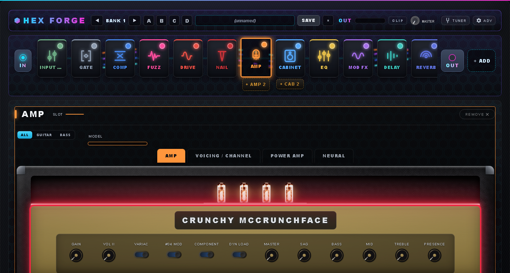
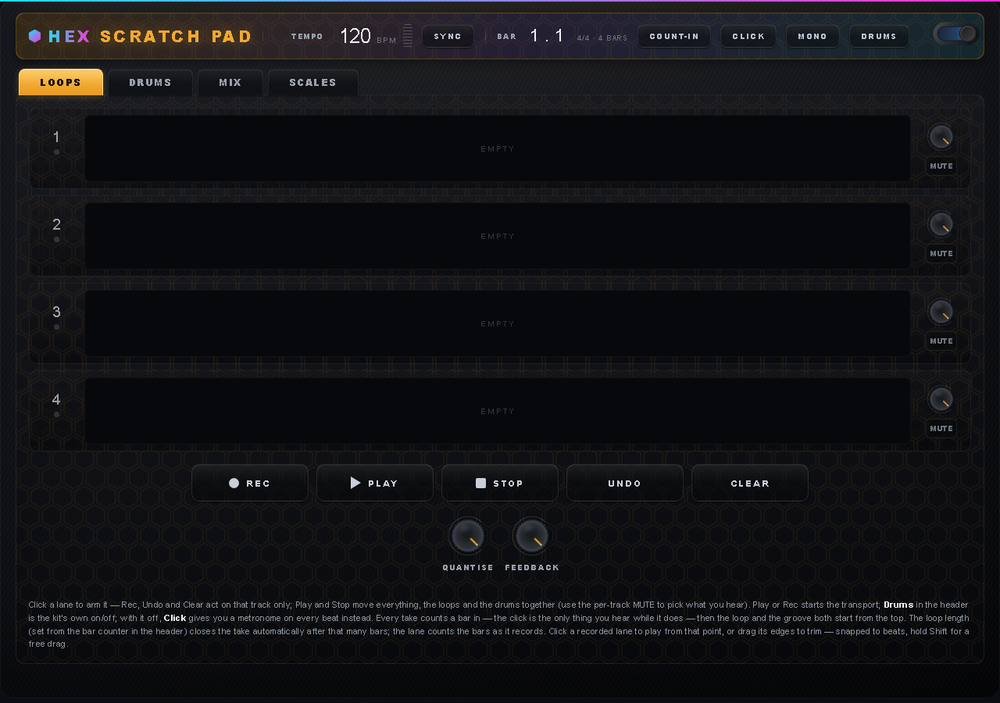

# Hex Chain — a complete guitar rig as LV2 plugins

Hex Chain is a suite of fifteen open-source LV2 plugins for the MOD / pi-Stomp platform,
Zynthian and desktop LV2 hosts, with **Hex Forge** (the whole chain in one plugin) also
available as a Windows and macOS plugin and standalone app.

Sixteen amp models, most of them built as circuits from their own drawings and run that way
by default. Twelve drive pedals, four fuzzes, a speaker-and-room cabinet stage with two mics,
nine modulations, five delays, three reverbs, a wah, a microtonal octaver, an industrial
"Nail" stage, an input stage that knows which guitar is plugged in, and a practice room with a
four-track looper and a synthesised drum kit. Every model is original DSP under a
trademark-clean parody name.



## Hex Forge

The flagship: the entire signal chain in a single plugin, built around a node-chain
interface. Every block is a card you tap to edit, drag to reorder and click to bypass.
Each movable effect exists twice (a second delay after the reverb, a second drive into the
amp), and a second amp and cab can run as a parallel rig.

- **Presets.** 32 banks of four slots, shipped with 80 factory rigs researched against the
  original records and level-matched so no preset jumps out. Recall is hands-free on the
  pi-Stomp footswitches (A/B/C/D and hold-both bank chords), and the browser filters as you
  type. Your own dial-ins live in the plugin's own store, survive a reinstall and are
  preserved across updates.
- **Input Trim with a GUITAR selector** (Default / Single Coil / Hot Pickups): tell it what
  is plugged in and it sets the pickup voicing for you, globally, saved with the board.
- **Per-block CPU meters, a strobe tuner, an auto-calibration wizard** for the input level,
  a dB-scaled output with a transparent clip limiter, and an optional stereo doubler.
- A **desktop build** (VST3 and standalone on Windows, AU/VST3 and standalone on macOS)
  with the same engine and the same panel; see [`desktop/BUILDING.md`](desktop/BUILDING.md).

## Scratch Pad



A practice room on the board. Four loop tracks of two minutes each, with a count-in, a bar
counter, bar-snapped non-destructive trim and a level knob per lane; loops survive a reload.
A drum machine with thirty grooves from rock eighths to djent and blast beats, a metronome,
and a kit resynthesised from measured drums as a few megabytes of parameters, so no sample
audio ships. A parallel-compressed drum bus with a room, a Scales tab with a readable
fretboard and chord grids, and a groove library you can save your own patterns into. It runs
stereo with a mono fold and costs about nine percent of a Pi 5 core.

## The plugins

| Plugin | What it is |
| --- | --- |
| **Input Trim** | Gain, phase, a 50/60 Hz hum comb, pickup loading, humbucker voicing (four models) and the GUITAR selector. |
| **Gate** | Noise gate with detection decoupled from the fade and a mains-hum detector. |
| **Compressor** | Two circuits: an optical amp-style compressor and a FET limiter, ratios to Limit. |
| **Fuzz** | Four pedals: a six-era Muff (Italian Hero), a fuzz with a Gate-controlled squeal (Fuzz Zachary), the octave fuzz (Octavius) and I Know It. |
| **Drive** | Twelve circuits: Green Man, New Dawn, Dear Rodent Boy, Grunge DS, Gilded Horse, Super Nova, Preamp 250, Echo Primer, Tube Chauffeur, Helsinki Grind, Treble Ranger, and NAM. |
| **Amp** | Sixteen models (see below) with a selectable power-amp tube, Component Build, Dynamic Load and Engine Quality controls, and NAM loading. |
| **Cabinet** | Built-in cabs and your own `.wav` IRs, a physical speaker model with drive, two mics (57, 421, ribbon, condenser), a room, and a rig selector. |
| **Modulation** | Lush-2, Uni-Verse, Phaser, Flanger, Tremolo, Rotary, Nevermind Chorus, Seasick Vibe, Script Phaser, with a centre-delay control. |
| **Delay** | Digital, Tape, Echo Wreck, Seraph (a dual delay), Vintage Echo (multi-head), with tempo sync and note divisions. |
| **Reverb** | Plate, Spring and Ambient (a shimmer bloom), classic or dense. |
| **Wah** | Auto and fixed. |
| **Octave** | Microtonal shimmer: quarter-tones, neutral intervals and an octave-and-a-quarter. |
| **Nail** | The industrial stage, five modes. |
| **Scratch Pad** | The looper and drum kit above. |
| **Hex Forge** | All of the above in one plugin, with presets and the pi-Stomp footswitch wiring. |

Every plugin has a custom MOD panel, named parameter groups for generic-UI hosts such as
Zynthian, a designated block-enable port, and runs at a fixed internal rate with
anti-aliased clipping.

### Amp models

Clean Meanie, Crunchy McCrunchFace, Gainzilla, Doom Daddy, Tangerang, Beardo BE, Hi-Volt,
Chime Thirty, Backline Plus, Plexiglass, Cali V, Diamond Plate, Tremont 15, Blue Liner,
Citrus 200, and Neural (NAM) for your own captures.

Ten of them have a **Component Build**: the amp solved stage by stage from its schematic,
with its own power section, screen sag, output-transformer saturation and feedback loop, and
a **Dynamic Load** that replaces the fixed load with a large-signal speaker. The component
builds are on by default and are loudness-matched to the algorithmic models, so a preset can
switch between the two.

Amp and Drive load **Neural Amp Modeler** captures in both the legacy and current `.nam`
formats. The Cabinet is pure convolution.

## Targets

- **pi-Stomp / MOD** (Pi 4 and 5, 64-bit): the portable aarch64 bundle on GitHub Releases.
  Extract it on the Pi and run `install.sh`. The factory pedalboard is pre-wired, so the
  footswitches work the moment you load it.
- **Zynthian and other generic-UI hosts:** the same bundle; every control carries its group
  and the enable port sits where such hosts expect it.
- **PatchStorage:** each plugin as its own listing for `linux-amd64`, `rpi-aarch64` and
  `patchbox-os-arm32` (NAM is hidden on the 32-bit target). The runbook is in
  [`build-tools/patchstorage/README.md`](build-tools/patchstorage/README.md).
- **Windows and macOS:** Hex Forge as a plugin and a standalone app, from the same release.

## Building

CMake project. The DSP engine lives in `deps/guitar-amp-simulator`; the NAM core and Eigen
are fetched at configure time. Everything installs into one bundle, `guitaramp-suite.lv2`.

```
cmake -S . -B build -DCMAKE_BUILD_TYPE=Release
cmake --build build -j4
cmake --install build --prefix ~/.local
```

On a 2 GB Pi build the NAM-linked targets one at a time (`-j1`). `build-tools/` holds the
pi-Stomp deploy scripts, the preset generator, the offline measurement harnesses and the
golden-render regression test; `bash build-tools/package_bundle.sh <ver>` builds the
release tarball locally. The desktop build is documented in
[`desktop/BUILDING.md`](desktop/BUILDING.md).

## Licensing — open source **and** commercial

This project is **dual-licensed** (see [`LICENSING.md`](LICENSING.md)):

- **GPL-3.0-or-later** ([`LICENSE`](LICENSE)) — free for the community to use, study,
  modify and share. Any product that incorporates this code must also be released as open
  source under the GPL.
- **Commercial license** — to ship this in a closed-source product without the GPL's
  copyleft obligations. **Contact Ryan Powell <rpowell5064@gmail.com>** to purchase.

Third-party components are listed in [`THIRD-PARTY-NOTICES.md`](THIRD-PARTY-NOTICES.md);
contributing terms are in [`CONTRIBUTING.md`](CONTRIBUTING.md). Release history is in
[`RELEASE_NOTES.md`](RELEASE_NOTES.md).

© 2026 Ryan Powell.
